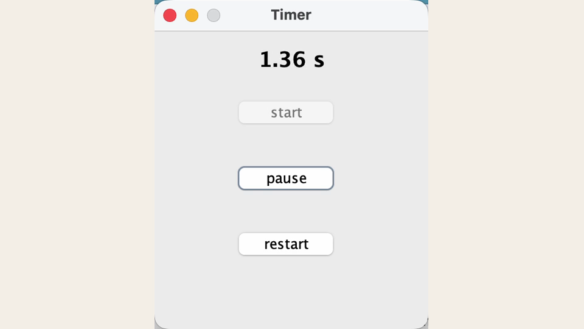

# Timer Module

A small Java Swing timer demonstrating start, pause, restart, and continuously updated elapsed-time state.

[中文说明](README_zh.md)

## Overview

Timer Module isolates a simple stateful desktop component. A worker loop advances the displayed value while active, pause preserves the current state, and restart returns the timer to its initial state.

## Screenshot



The screenshot comes directly from the running Swing timer.

## Features

- Start
- Live elapsed-time display
- Pause/continue
- Restart/reset
- Swing desktop interface

## Run

The committed JAR was verified with Java 25:

```bash
java -jar Timer-module.jar
```

## Accuracy note

The implementation increments a floating-point value after `Thread.sleep(1)`. This demonstrates timer state and UI updates, but it should not be described as measured one-millisecond precision without benchmarking.
